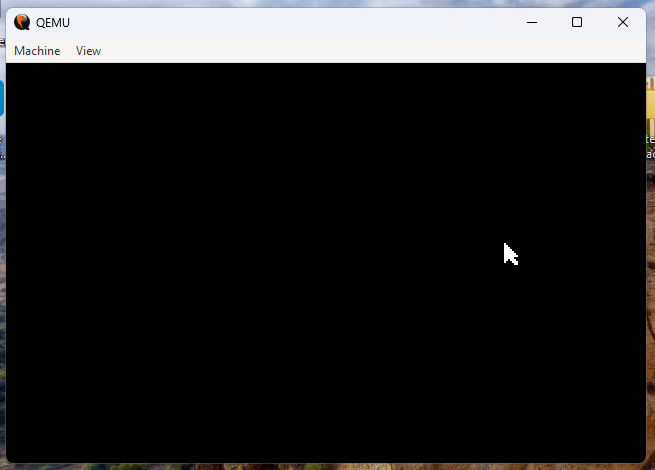

# Simple-Assembly-cursor
This is a simple cursor made in Assembly for you use for your Assembly OS

IF YOU WANT TO USE THIS CURSOR IN YOUR OS, GIVE CREDITS FOR US

This cursor is made to people learn how a cursor works

# Some credits
https://github.com/ArTicZera/AcidOS
This cursor is based in AcidOS painting cursor
